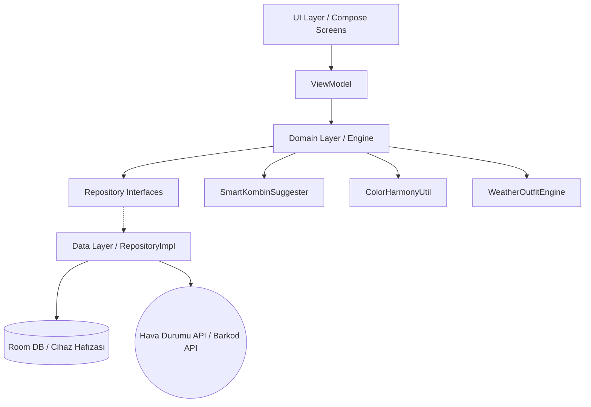

<div align="center">

  

  # 📱 CepteKabin v2.0

  **Yapay Zeka Destekli Moda Asistanı, Dijital Gardırop ve Kişisel Kombin Planlayıcı**

  [](https://kotlinlang.org)
  [](https://developer.android.com/jetpack/compose)
  [](#-mimari-yap%C4%B1)
  [](https://developers.google.com/ml-kit)
  [](LICENSE)

  <br>

  <a href="https://github.com/cyberQbit/CepteKabin/releases/latest">
    
  </a>

  <p><b>✨ Kendi gardırobunu cebinde taşı, yapay zeka ile tarzını baştan yarat! ✨</b></p>

</div>

---

## 📋 İçindekiler
- [✨ Temel Özellikler](#-temel-özellikler)
- [🧠 Yapay Zeka Motorları](#-yapay-zeka-motorları)
- [🛠️ Teknoloji Yığını](#️-teknoloji-yığını)
- [🏗️ Mimari Yapı](#️-mimari-yapı)
- [📅 Kombin Takvimi](#-kombin-takvimi)
- [🎨 Liquid Glass Arayüz](#-liquid-glass-arayüz)
- [⚙️ Kurulum ve Geliştirme](#️-kurulum-ve-geliştirme)
- [🤝 Katkıda Bulunma](#-katkıda-bulunma)

---

## ✨ Temel Özellikler

| Özellik | Açıklama |
|---------|----------|
| **☁️ Akıllı Hava Durumu** | 5 günlük hava tahmini + dinamik arka planlar. Her gün için tıklanabilir tahmin kartları ve kıyafet önerisi |
| **🧠 AI Kombin Önerileri** | Dolabındaki kıyafetlerden, hava durumuna ve renk uyumuna göre otomatik kombin önerileri. Konfor endeksi ile kombin puanlaması |
| **📦 Gizlilik Odaklı Depolama** | Görseller cihazda `.nomedia` klasörlerinde şifrelenerek saklanır. Galeride görünmez, kota yemez |
| **🛒 Barkod ile Hızlı Ekleme** | Barkod okut, ürün bilgilerini otomatik doldur. ML Kit OCR ile manuel girişe gerek kalmadan saniyeler içinde ekle |
| **📅 Kombin Takvimi** | Önümüzdeki 30 güne kombin planla. Günde 3 kombin, geçmiş günler arşiv modunda görüntülenir |
| **🎨 Renk Uyumu Analizi** | 12 renk grubu üzerinden kombinasyon puanlaması. Tam uyum, analog ve komplementer renk eşleştirmeleri |
| **👤 Sanal Prova (Yakında)** | Fotoğraf doğrulama ile yüz tespiti yap, kıyafetleri üstünde gör. ML Kit ile 400x600+ çözünürlük kontrolü |

---

## 🧠 Yapay Zeka Motorları

### WeatherOutfitEngine
Hava durumunu analiz ederek kıyafet önerir. **7 kategori** destekler:

| Kategori | Sıcaklık Aralığı | Örnek Kıyafetler |
|----------|-----------------|-----------------|
| Kavurucu | ≥ 35°C | Tişört, Şort, Sandalet |
| Sıcak | 28-34°C | Tişört, Polo, Sneaker |
| Ilık | 20-27°C | Gömlek, Bluz, Chino |
| Serin | 12-19°C | Sweatshirt, Kazak, Bot |
| Soğuk | 5-11°C | Mont, Kalın Pantolon, Atkı |
| Çok Soğuk | 0-4°C | Termal içlik, Kaban, Eldiven |
| Dondurucu | < 0°C | Parka, Yün Çorap, Bere |

**Konfor Endeksi:** Sıcaklık, nem, rüzgar ve yağış faktörlerini birleştiren 0-100 arası skor.

### SmartKombinSuggester
Dolabındaki kıyafetlerden **en uyumlu kombinasyonları** üretir:
- Renk uyumu %40, hava uyumu %60 ağırlıklı puanlama
- Mevsim ve hava durumuna göre katman önerisi (1-3 katman)
- Maksimum 3 öneri, tekrarlanmayan seçimler

### ColorHarmonyUtil
Renk uyumu puanlama algoritması:

```
Uyum Puanı (100 üzerinden):
• Aynı renk grubu         → 85 puan
• Nötr renk ile kombinasyon → 95 puan
• Lacivert bazlı          → 90 puan
• Komplementer (tamamlayıcı) → 80 puan
• Analog (yan yana)       → 75 puan
• Çakışan renkler         → 45 puan
```

---

## 🛠️ Teknoloji Yığını

| Kategori | Teknolojiler / Araçlar |
|:---------|:-----------------------|
| **Dil & UI** | Kotlin, Jetpack Compose, Material Design 3 |
| **Mimari** | Clean Architecture, MVVM, Compose Navigation |
| **Asenkron / Akış** | Coroutines, StateFlow, SharedFlow |
| **Veritabanı** | Room Database (v6, TakvimGirisi, WeatherCache) |
| **Ağ** | Retrofit2, OkHttp3, Gson |
| **AI & Görüntü** | Google ML Kit (Face Detection, OCR), CameraX |
| **Görsel Yükleme** | Coil (AsyncImage) |
| **Bulut (Opsiyonel)** | Firebase Auth, Cloud Firestore |
| **DI** | Dagger-Hilt |
| **Dosya** | Android FileProvider, .nomedia korumalı depolama |

---

## 🏗️ Mimari Yapı

Clean Architecture + MVVM yapısı ile sürdürülebilir ve test edilebilir kod:



### Ana Modüller

```
app/src/main/java/com/cyberqbit/ceptekabin/
├── domain/
│   ├── model/          # Kiyaket, Kombin, HavaDurumu, ForecastItem
│   ├── engine/          # WeatherOutfitEngine, SmartKombinSuggester, ColorHarmonyUtil
│   └── repository/      # Repository interfaces
├── data/
│   ├── local/
│   │   ├── database/   # Room entities, DAOs, Database (v6)
│   │   └── dao/        # TakvimGirisiDao, WeatherCacheDao, vb.
│   ├── repository/     # Repository implementations
│   └── service/        # LocationService
├── ui/
│   ├── screens/        # Home, Dolap, Kombin, HavaDurumu, Takvim, Onboarding
│   ├── components/      # GlassCard, GlassSurface, RenkDairesi
│   ├── navigation/      # NavGraph, Screen routes
│   └── theme/          # Color, Type, Theme (Dark/Light)
└── util/              # Constants, PhotoValidationUtil
```

---

## 📅 Kombin Takvimi

Planlama özellikleri:

- **30 günlük görünüm** - geçmişe 5 gün, ileriye 30 gün
- **Günde 3 kombin hakkı** - sabah, öğle, akşam slotları
- **Arşiv modu** - geçmiş günler salt okunur
- **Anlık snapshot** - kıyafetin güncel görseli kaydedilir (kıyafet silinse bile görünür)
- **Kullanım takibi** - her kıyafetin kaç kez giyildiği ve son giyim tarihi

---

## 🎨 Liquid Glass Arayüz

**Liquid Glass (Camsız Cam)** felsefesi - yarı saydam yüzeyler ve blur efektleri:

- **GlassCard / GlassSurface** - 12+ composable'da tutarlı blur + border + rounded corner
- **Dynamic Weather Backgrounds** - hava durumuna göre 5 farklı gradient tema
- **60 FPS Animasyonlar** - pager, scroll, expand/collapse
- **Karanlık Mod** - tüm ekranlarda tam uyumlu renk paleti
- **Konfor Endeksi Badge** - yeşil/sarı/kırmızı renk kodlu hava konfor göstergesi

### Tasarım Sistemi

| Token | Değer |
|-------|-------|
| Primary | `#2196F3` (Mavi) |
| Secondary | `#00BCD4` (Cyan) |
| Accent | `#FFB300` (Altın) |
| Error | `#E53935` |
| Glass Light | `0.7f` opacity + blur |
| Glass Dark | `0.5f` opacity + blur |

---

## ⚙️ Kurulum ve Geliştirme

### Ön Koşullar

- Android Studio (Koal veya daha yeni)
- JDK 17+
- `google-services.json` (Firebase için)
- Google ML Kit bağımlılıkları

### Adımlar

1.  Depoyu klonlayın:
    ```bash
    git clone https://github.com/cyberQbit/CepteKabin.git
    cd CepteKabin
    ```

2.  Firebase Console'dan aldığınız `google-services.json` dosyasını `app/` klasörüne koyun.

3.  `Constants.kt` içindeki `WEB_CLIENT_ID` alanını kendi Firebase Web Client ID'niz ile değiştirin.

4.  Projeyi derleyin:
    ```bash
    ./gradlew clean
    ./gradlew assembleRelease
    ```

### Önemli Notlar

> ⚠️ **Veritabanı v6:** Kullanıcılar ilk açılışta versiyon yükseltmesi nedeniyle eski verilerini kaybedecek. `fallbackToDestructiveMigration()` aktif.

> 💡 **Konum İzni:** Hava durumu için `ACCESS_FINE_LOCATION` izni gereklidir. Verilmezse varsayılan "Ankara" gösterilir.

---

## 🤝 Katkıda Bulunma

Açık kaynak dünyasını destekliyoruz! Yeni özellik eklemek, bug çözmek veya arayüzü geliştirmek için:

1.  Projeyi Fork'layın
2.  Yeni branch oluşturun (`git checkout -b feature/YeniFikir`)
3.  Değişikliklerinizi commit'leyin (`git commit -m 'AI kombin önerisi modülü eklendi'`)
4.  Branch'inizi push'layın ve Pull Request açın

---

<div align="center">
<p><b>cyberQbit</b> tarafından ❤️ ile geliştirilmiştir.</p>
</div>
