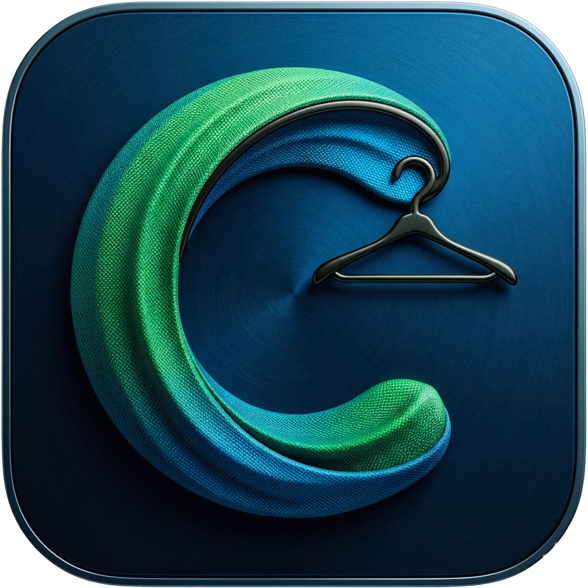

<div align="center">

  

  # 📱 CepteKabin v2.1

  **Yapay Zeka Destekli Moda Asistanı, Dijital Gardırop ve Kişisel Kombin Planlayıcı**

  [](https://kotlinlang.org)
  [](https://developer.android.com/jetpack/compose)
  [](#-mimari-yap%C4%B1)
  [](#-modern-aray%C3%BCz)
  [](https://developers.google.com/ml-kit)
  [](LICENSE)

  <br>

  <a href="https://play.google.com/store/apps/details?id=com.cyberqbit.ceptekabin">
    
  </a>
  <br><br>
  <a href="https://github.com/cyberQbit/CepteKabin/releases/latest">
    
  </a>

  <p><b>✨ Kendi gardırobunu cebinde taşı, yapay zeka ile tarzını baştan yarat! ✨</b></p>

</div>

---

## 📋 İçindekiler
- [🎉 v2.1 Yenilikler](#-v21-yenilikler)
- [✨ Temel Özellikler](#-temel-özellikler)
- [🧠 Yapay Zeka Motorları](#-yapay-zeka-motorları)
- [🛠️ Teknoloji Yığını](#️-teknoloji-yığını)
- [🏗️ Mimari Yapı](#️-mimari-yapı)
- [📅 Kombin Takvimi](#-kombin-takvimi)
- [🎨 Modern Arayüz](#-modern-arayüz)
- [⚙️ Kurulum ve Geliştirme](#️-kurulum-ve-geliştirme)
- [🤝 Katkıda Bulunma](#-katkıda-bulunma)

---

## 🎉 v2.1 Yenilikler

### 🌟 iOS Tarzı UI Polish

> _"Android'de iOS hissi"_

| Özellik | Önce | Sonra |
|---------|------|-------|
| Navigation Bar | Label'lı, düz ikonlar | Sadece ikon, filled/outlined değişimi |
| Seçili İndikatör | Varsayılan M3 indicator | 52dp yuvarlak background |
| Kart Press | Ripple efekti | iOS tarzı spring scale (0.97-0.98f) |
| Loading | Circular progress | Shimmer skeleton animasyonu |
| Geçişler | Hızlı fade | SlideUpFadeIn (fade + slide) |
| Status/Nav Bar | Sistem varsayılanı | Edge-to-edge şeffaf |

### 🆕 Yeni Özellikler (v2.1)

| Özellik | Açıklama |
|---------|----------|
| **Onboarding Screen** | 3 sayfalık uygulama tanıtımı |
| **Shimmer Loading** | Veri yüklenirken premium shimmer animasyonu |
| **Press Effect** | Kartlara basıldığında spring scale animasyonu |
| **Modern Hotbar** | iOS tarzı filled/outlined ikon değişimi |
| **PhotoValidationUtil** | ML Kit ile fotoğraf doğrulama |
| **Kombin Takvimi** | 30 gün görünüm, günde 3 kombin, snapshot |

### 🐛 Hata Düzeltmeleri (v2.1)

- Hotbar'da aynı sekmeye tıklama çalışmıyordu → Düzeltildi
- Hava durumu yenileme butonu çalışmıyordu → Düzeltildi
- Alt içerik kesiliyordu → Bottom padding artırıldı (96dp)
- Dolap boş durumu düzgün hizalanmıyordu → Düzeltildi
- FAB navigation bar ile çakışıyordu → Margin ayarlandı (80dp)

---

## ✨ Temel Özellikler

| Özellik | Açıklama |
|---------|----------|
| **☁️ Akıllı Hava Durumu** | 5 günlük hava tahmini + dinamik arka planlar |
| **🧠 AI Kombin Önerileri** | Hava durumuna ve renk uyumuna göre otomatik kombin önerileri |
| **📦 Gizlilik Odaklı Depolama** | Görseller `.nomedia` klasörlerinde şifrelenir |
| **🛒 Barkod ile Hızlı Ekleme** | ML Kit OCR ile barkod okutma |
| **📅 Kombin Takvimi** | 30 güne kombin planla, günde 3 kombin |
| **🎨 Renk Uyumu Analizi** | 12 renk grubu üzerinden kombinasyon puanlaması |
| **👤 Sanal Prova** | Fotoğraf doğrulama ile yüz tespiti |

---

## 🧠 Yapay Zeka Motorları

### WeatherOutfitEngine
7 hava kategorisi ile kıyafet önerir:

| Kategori | Sıcaklık | Örnek Kıyafetler |
|----------|----------|------------------|
| Kavurucu | ≥ 35°C | Tişört, Şort, Sandalet |
| Sıcak | 28-34°C | Tişört, Polo, Sneaker |
| Ilık | 20-27°C | Gömlek, Bluz, Chino |
| Serin | 12-19°C | Sweatshirt, Kazak, Bot |
| Soğuk | 5-11°C | Mont, Kalın Pantolon, Atkı |
| Çok Soğuk | 0-4°C | Termal içlik, Kaban, Eldiven |
| Dondurucu | < 0°C | Parka, Yün Çorap, Bere |

**Konfor Endeksi:** 0-100 arası skor (sıcaklık, nem, rüzgar, yağış)

### SmartKombinSuggester
Dolabınızdaki kıyafetlerden **en uyumlu kombinasyonları** üretir:
- Renk uyumu %40, hava uyumu %60 ağırlıklı
- Mevsim ve hava durumuna göre 1-3 katman önerisi
- Maksimum 3 öneri, tekrarlanmayan seçimler

### ColorHarmonyUtil
```
Uyum Puanı (100 üzerinden):
• Aynı renk grubu           → 85 puan
• Nötr renk ile kombinasyon  → 95 puan
• Lacivert bazlı            → 90 puan
• Komplementer              → 80 puan
• Analog (yan yana)         → 75 puan
• Çakışan renkler           → 45 puan
```

---

## 🛠️ Teknoloji Yığını

| Kategori | Teknolojiler |
|:---------|:-------------|
| **Dil & UI** | Kotlin, Jetpack Compose, Material Design 3 |
| **Mimari** | Clean Architecture, MVVM, Compose Navigation |
| **Asenkron** | Coroutines, StateFlow, SharedFlow |
| **Veritabanı** | Room Database (v6) |
| **Ağ** | Retrofit2, OkHttp3, Gson |
| **AI & Görüntü** | Google ML Kit (Face, OCR), CameraX |
| **Görsel** | Coil (AsyncImage) |
| **DI** | Dagger-Hilt |
| **Cloud** | Firebase Auth, Cloud Firestore (opsiyonel) |

---

## 🏗️ Mimari Yapı

```
app/src/main/java/com/cyberqbit/ceptekabin/
├── domain/
│   ├── model/          # Kiyaket, Kombin, HavaDurumu, ForecastItem
│   ├── engine/          # WeatherOutfitEngine, SmartKombinSuggester, ColorHarmonyUtil
│   ├── repository/      # Repository interfaces
│   └── util/           # PhotoValidationUtil
├── data/
│   ├── local/
│   │   ├── database/   # Room entities, DAOs, Database (v6)
│   │   └── dao/        # TakvimGirisiDao, WeatherCacheDao
│   ├── repository/     # Repository implementations
│   └── service/        # LocationService
├── ui/
│   ├── screens/        # Home, Dolap, Kombin, HavaDurumu, Takvim, Onboarding
│   ├── components/     # GlassCard, GlassSurface, ShimmerLoading, RenkDairesi
│   ├── navigation/     # NavGraph, Screen routes
│   └── theme/          # Color, Type, Theme, Animations
└── util/              # Constants
```

---

## 📅 Kombin Takvimi

- **30 günlük görünüm** - geçmişe 5 gün, ileriye 30 gün
- **Günde 3 kombin** - sabah, öğle, akşam slotları
- **Arşiv modu** - geçmiş günler salt okunur
- **Anlık snapshot** - kıyafet silinse bile görsel kaydedilir
- **Kullanım takibi** - her kıyafetin kaç kez giyildiği

---

## 🎨 Modern Arayüz

### iOS Tarzı Animasyonlar

| Animasyon | Açıklama |
|-----------|----------|
| **Press Effect** | 0.97-0.98f scale, spring(damping=0.7, stiffness=400) |
| **SlideUpFadeIn** | fade(300ms) + slideUp(spring damping=0.8) |
| **Shimmer** | 1200ms döngü, FastOutSlowInEasing |
| **Page Transition** | slideHorizontal + fade, spring(damping=0.85) |

### GlassCard / GlassSurface
- 16dp corner radius
- Light: 0.85f opacity, Dark: 0.7f opacity
- 1dp subtle border
- Soft shadow

### Modern Navigation Bar
- Sadece ikonlar (label yok)
- Aktif: dolu (filled) ikon + 52dp yuvarlak background
- Pasif: çerçeveli (outlined) ikon
- 28dp ikon boyutu
- iOS tarzı spring press effect

### Tasarım Sistemi

| Token | Değer |
|-------|-------|
| Primary | `#2196F3` |
| Secondary | `#00BCD4` |
| Accent | `#FFB300` |
| Error | `#E53935` |

---

## ⚙️ Kurulum ve Geliştirme

### Ön Koşullar
- Android Studio (Koal+)
- JDK 17+
- `google-services.json` (Firebase)
- Google ML Kit

### Adımlar

```bash
git clone https://github.com/cyberQbit/CepteKabin.git
cd CepteKabin
```

2. Firebase Console'dan `google-services.json`'ı `app/` klasörüne koyun

3. `Constants.kt` içindeki `WEB_CLIENT_ID`'yi güncelleyin

4. Derleyin:
```bash
./gradlew clean
./gradlew assembleRelease
```

### Önemli Notlar

> ⚠️ **Veritabanı v6:** İlk açılışta eski veriler silinecek. `fallbackToDestructiveMigration()` aktif.

> 💡 **Konum İzni:** Hava durumu için `ACCESS_FINE_LOCATION` gereklidir.

---

## 🤝 Katkıda Bulunma

1. Fork'layın
2. Branch oluşturun (`git checkout -b feature/YeniFikir`)
3. Commit'leyin
4. Push'layın ve Pull Request açın

---

<div align="center">
<p><b>cyberQbit</b> tarafından ❤️ ile geliştirilmiştir.</p>
</div>
